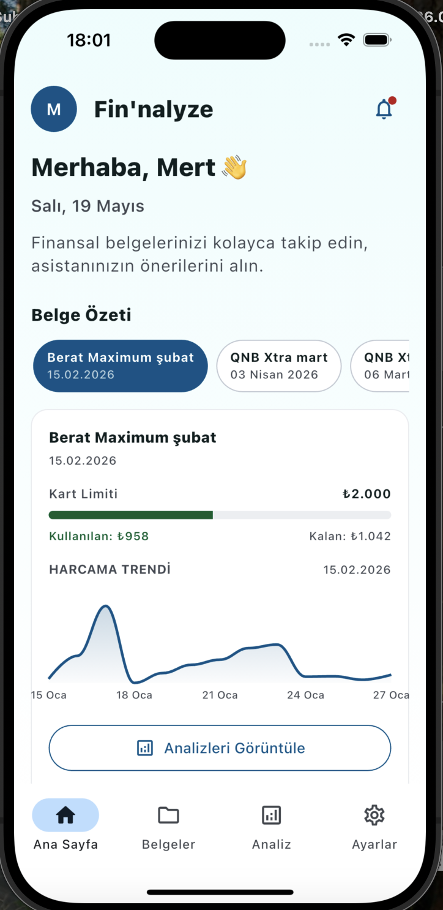
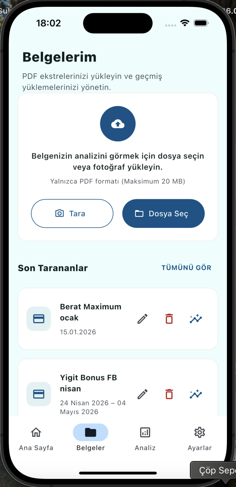
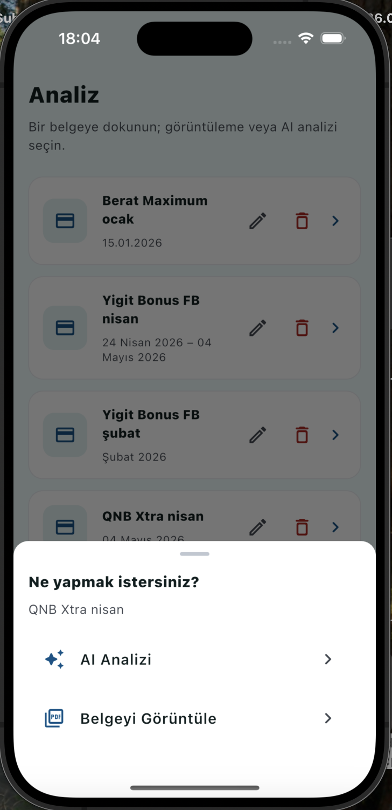
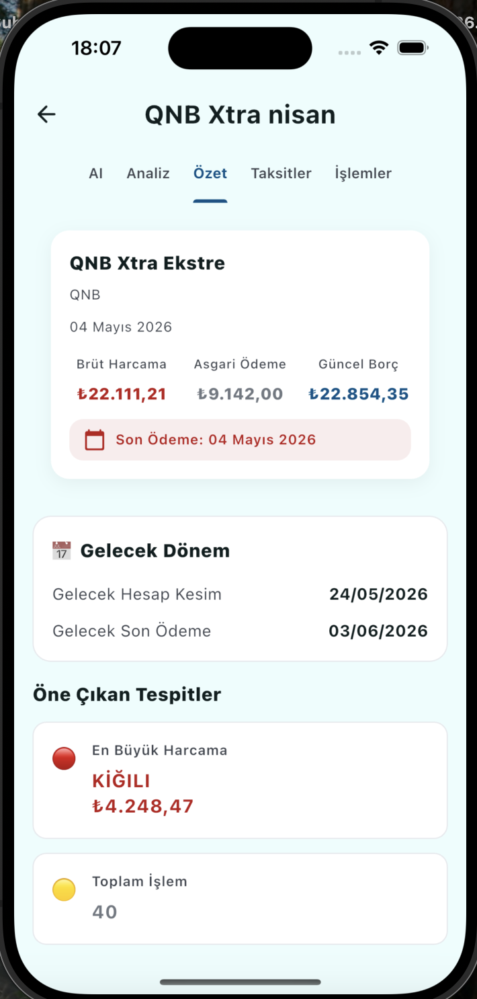
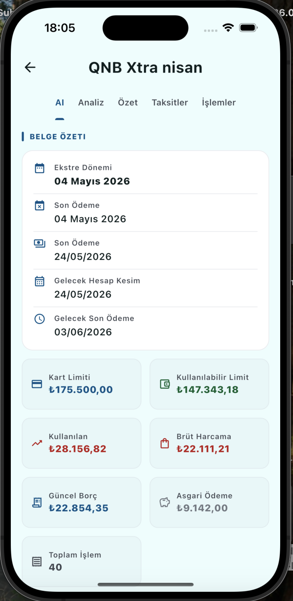
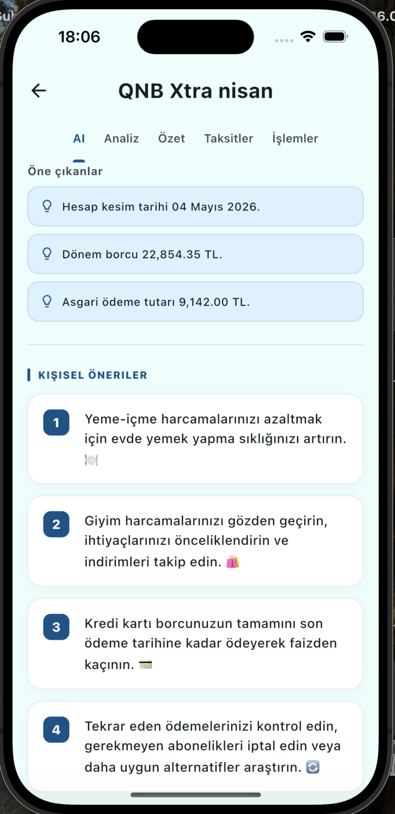
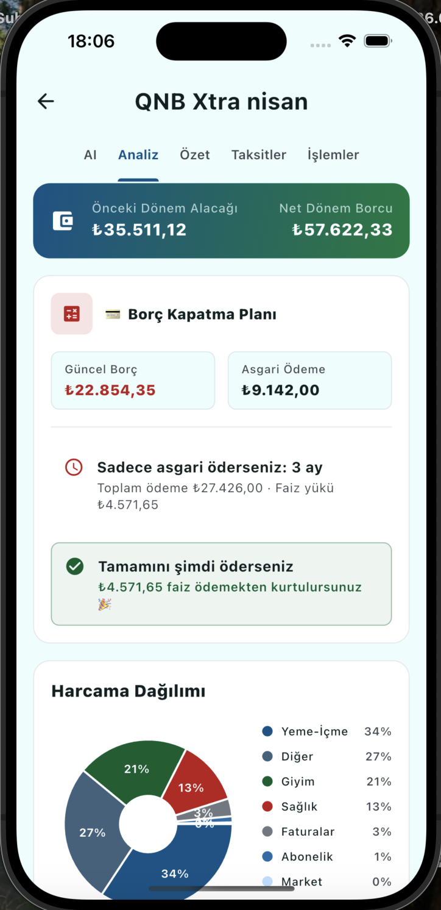
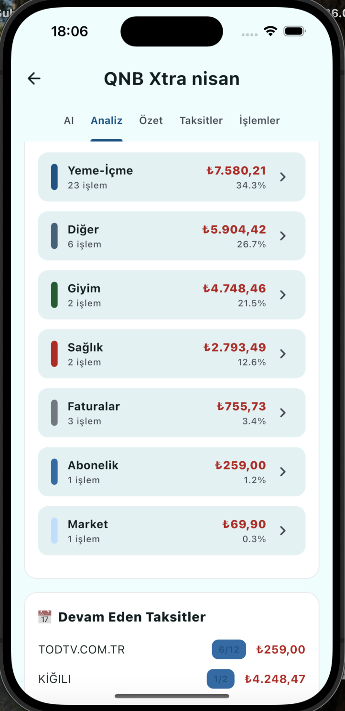
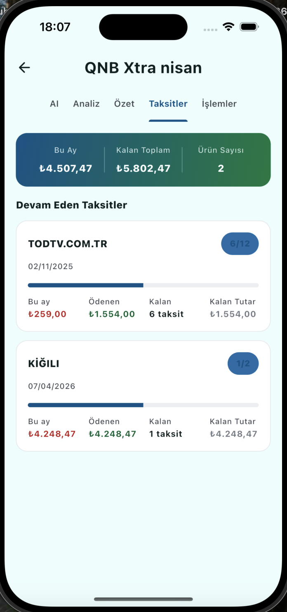
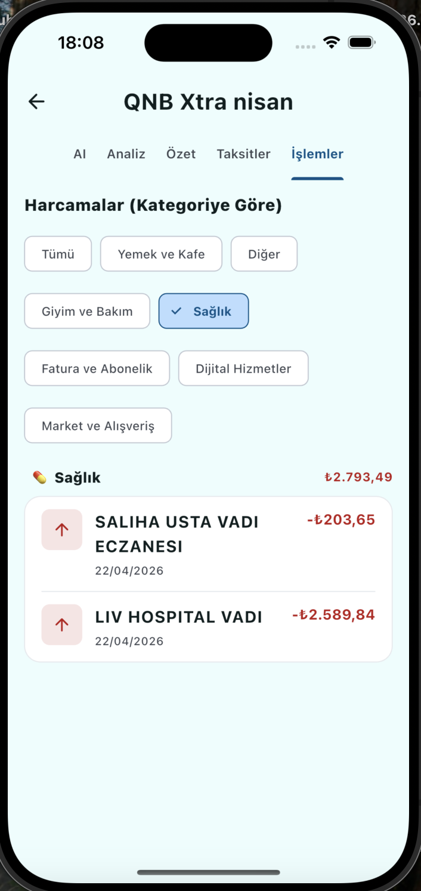

# Fin'nalyze

## Fin'nalyze ne işe yarar?

Fin'nalyze, banka ve kredi kartı ekstrelerini Google Gemini ile saniyeler içinde analiz eder. İşlemler otomatik kategorilere ayrılır, yapılan harcamalar ve taksitler takip edilir, borç kapatma senaryoları hesaplanır ve kişiselleştirilmiş Türkçe öneriler üretilir, verileriniz cihazınızdan çıkmaz.

---

## Ekranlar

| Ana Sayfa | Belgelerim | Analiz |
|:---------:|:----------:|:------:|
|  |  |  |

| Belge Özeti | Kart Detayı | AI Önerileri |
|:-----------:|:-----------:|:------------:|
|  |  |  |

| Borç Planı | Harcama Kategorileri | Taksitler | 
|:----------:|:--------------------:|:---------:|
|  |  |  |

| İşlemler |
|:--------:|
|  |

---

## Özellikler

- 📄 PDF veya kamera ile belge yükleme
- 🤖 Google Gemini ile otomatik gelir / gider / kategori analizi
- 💳 Kart limiti, kullanılan tutar, son ödeme tarihi çıkarımı
- 📊 Harcama kategorisi dağılımı ve pasta grafik
- 🧮 Borç kapatma hesaplayıcısı — asgari vs. tam ödeme karşılaştırması
- 📅 Taksit takip tabı — kaç taksit kaldı, ne ödendi, kalan tutar
- ✨ Kişiselleştirilmiş Türkçe AI önerileri
- 📁 Çok belge yönetimi — belgeler arası karşılaştırma
- 🔒 Tamamen yerel depolama — veriler cihazdan çıkmaz
- 🌐 Türkçe / İngilizce lokalizasyon

## Teknoloji

| Katman | Araç |
|--------|------|
| Framework | Flutter + Dart |
| State / Navigation | GetX |
| Yapay Zeka | Google Gemini 2.5 Flash Lite |
| Yerel Depolama | GetStorage |
| Grafikler | fl_chart |
| PDF İşleme | pdfx + file_picker |

---

Hack3athon 2026 için geliştirilmiştir.

